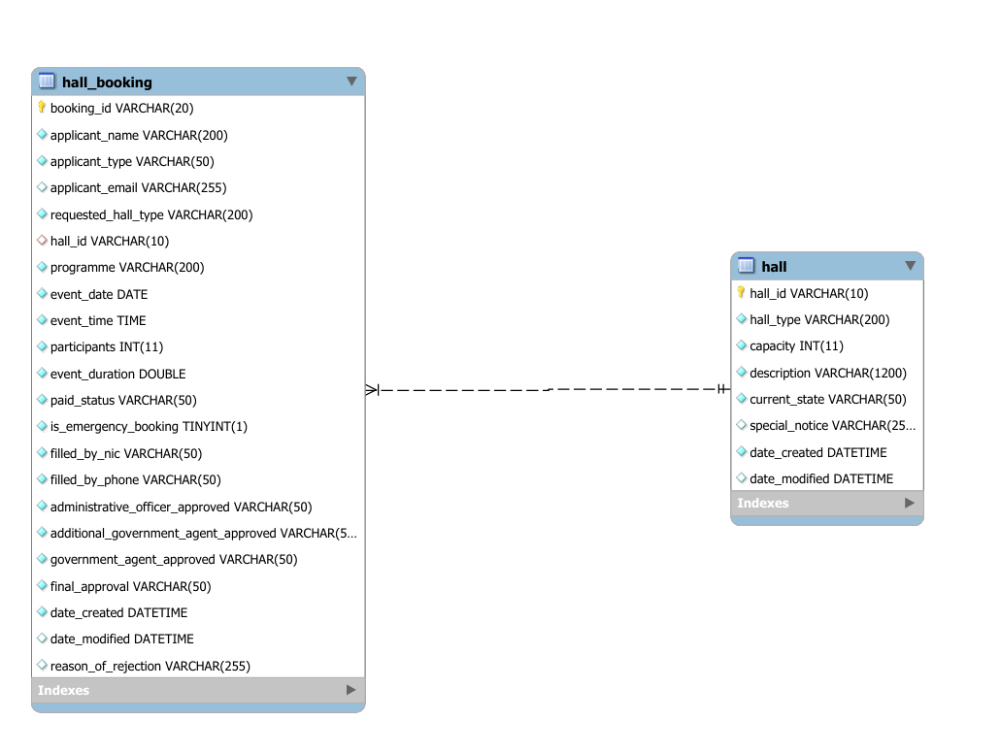
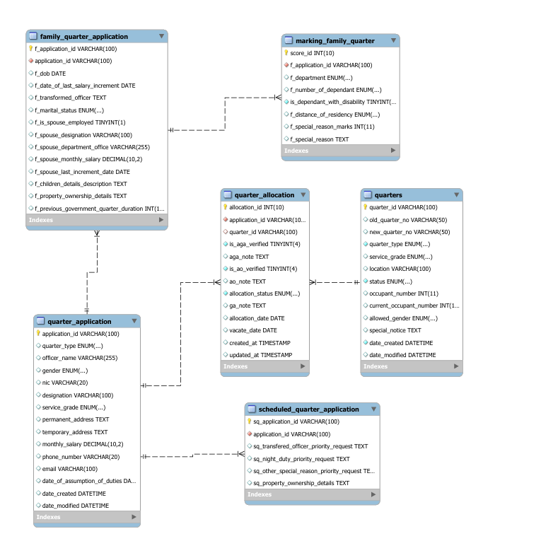
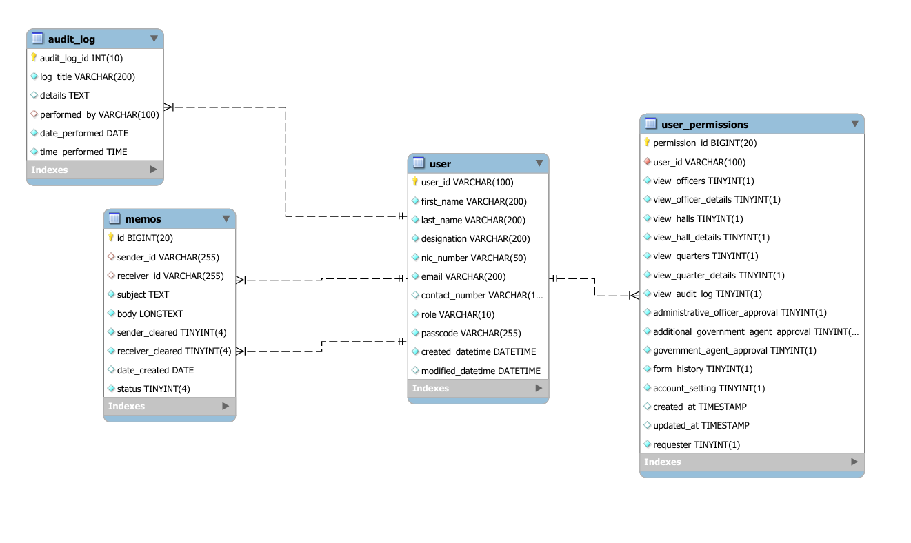
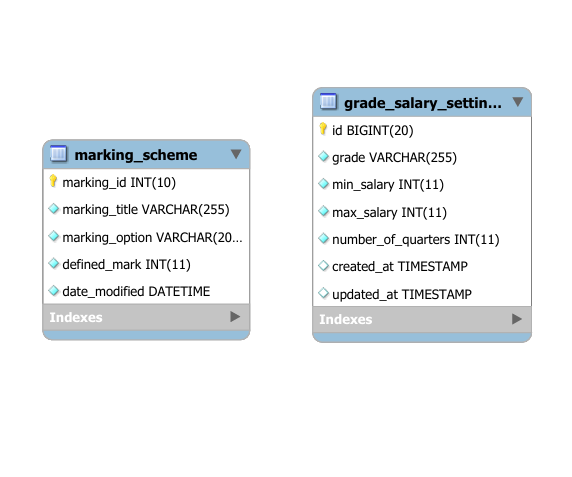

# Database Technical Developer Manual

This document provides a comprehensive overview of the database design and schema for the Resource Booking System.

## 1. Database Overview
The system uses a relational database to manage users, hall bookings, quarters allocations, and system audit logs.

## 2. Entity Relationship Diagrams

### 2.1 Hall Booking System

### 2.2 Quarters Management System

### 2.3 User and Permissions

### 2.4 Helper Tables (Salary & Marking)

## 3. Core Tables

### 3.1 `user` & `user_permissions`
Stores system user accounts and their granular permission levels.
- **`user`**: `user_id` (PK), `first_name`, `last_name`, `designation`, `nic_number`, `email`, `contact_number`, `role`, `passcode`, `created_datetime`, `modified_datatime`.
- **`user_permissions`**: `permission_id` (PK), `user_id` (FK), `view_officers`, `view_officer_details`, `view_halls`, `view_hall_details`, `view_quarters`, `view_quarter_details`, `view_audit_log`, `administrative_officer_approval`, `additional_government_agent_approval`, `government_agent_approval`, `form_history`, `account_setting`, `requester`.

### 3.2 `hall` & `hall_booking`
Manages physical resources and their reservation records.
- **`hall`**: `hall_id` (PK), `hall_type`, `capacity`, `description`, `current_state`, `special_notice`, `date_created`, `date_modified`.
- **`hall_booking`**: `booking_id` (PK), `hall_id` (FK), `applicant_name`, `applicant_type`, `applicant_email`, `requested_hall_type`, `programme`, `event_date`, `event_time`, `start_time`, `end_time`, `participants`, `event_duration`, `paid_status`, `approval_status_ao`, `approval_status_aga`, `approval_status_ga`, `final_approval`, `ao_user`, `aga_user`, `ga_user`, `is_emergency_booking`, `filled_by_nic`, `filled_by_phone`, `reason_of_rejection`, `date_created`, `date_modified`.

### 3.3 `quarters` & `quarter_application`
Handles residential asset management and the application lifecycle.
- **`quarters`**: `quarter_id` (PK), `old_quarter_no`, `new_quarter_no`, `quarter_type`, `service_grade`, `location`, `status`, `occupant_number`, `allowed_gender`, `special_notice`, `current_occupant_number`, `date_created`, `date_modified`.
- **`quarter_application`**: `application_id` (PK), `quarter_type`, `officer_name`, `gender`, `nic`, `designation`, `service_grade`, `permanent_address`, `temporary_address`, `monthly_salary`, `phone_number`, `email`, `date_of_assumption_of_duties`, `date_created`, `date_modified`.

### 3.4 Specific Application Meta (`family` & `scheduled`)
Extended details for specific quarter application types.
- **`family_quarter_application`**: `f_application_id` (PK), `application_id` (FK), `f_dob`, `f_date_of_last_salary_increment`, `f_marital_status`, `f_is_spouse_employed`, `f_spouse_designation`, `f_spouse_department_office`, `f_spouse_monthly_salary`, `f_spouse_last_increment_date`, `f_children_details_description`, `f_property_ownership_details`, `f_previous_government_quarter_duration`, `f_transformed_officer`.
- **`scheduled_quarter_application`**: `sq_application_id` (PK), `application_id` (FK), `sq_transfered_officer_priority_request`, `sq_night_duty_priority_request`, `sq_other_special_reason_priority_request`, `sq_property_ownership_details`.

### 3.5 `quarter_allocation` & `marking_family_quarter`
The final state of allocation and the internal scoring mechanism.
- **`quarter_allocation`**: `allocation_id` (PK), `application_id` (FK), `quarter_id` (FK), `is_aga_verified`, `aga_note`, `is_ao_verified`, `ao_note`, `ga_note`, `allocation_status`, `allocation_date`, `vacate_date`.
- **`marking_family_quarter`**: `score_id` (PK), `f_application_id` (FK), `f_department`, `f_number_of_dependant`, `is_dependant_with_disability`, `f_distance_of_residency`, `f_special_reason`, `f_special_reason_marks`.

## 4. Audit, System & Communication

### 4.1 `audit_log`
Tracks administrative actions across the system.
- `audit_log_id` (PK), `log_title`, `details`, `performed_by` (FK), `date_performed`, `time_performed`.

### 4.2 `memos`
Secured internal messaging for inter-departmental communication.
- `id` (PK), `sender_id` (FK), `receiver_id` (FK), `subject` (encrypted), `body` (encrypted), `status`, `sender_cleared`, `receiver_cleared`, `date_created`.

### 4.3 `marking_scheme` & `grade_salary_settings`
System-wide configuration for automated calculations.
- **`marking_scheme`**: Stores weighted values for different criteria.
- **`grade_salary_settings`**: Stores eligibility rules based on service grade.

---
*Note: Full schema visualizations are provided in the EER diagrams above.*

