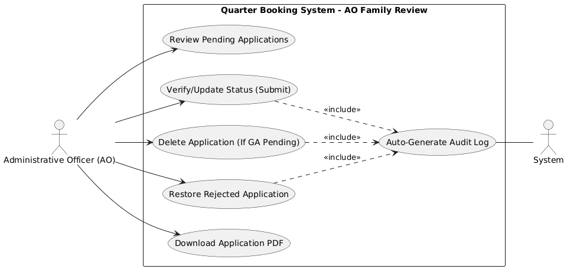
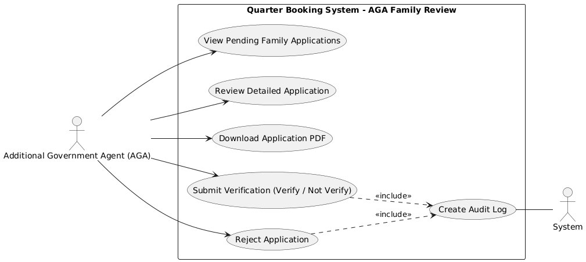
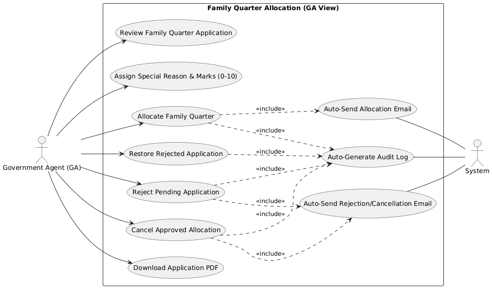
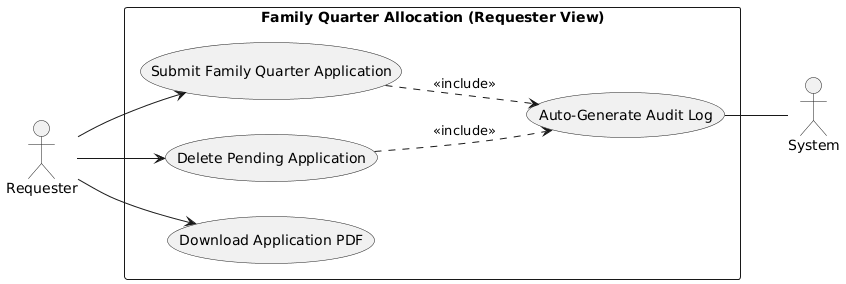

# Developer Guide: Family Quarter Approval & Allocation Process

This document provides a technical walkthrough of the approval and allocation lifecycle for Family Quarters in the Resource Booking System.

---

## 1. Approval Workflow Overview

The family quarter application follows a multi-stage review process before a final housing allocation is made.

### Roles and Responsibilities
- **Administrative Officer (AO)**: Verifies the initial application data and marking validity.
- **Additional Government Agent (AGA)**: Performs secondary verification.
- **Government Agent (GA)**: The ultimate authority for allocating the physical quarter or rejecting the application.

### Use Case Diagrams by Role

#### Administrative Officer (AO)

#### Additional Government Agent (AGA)

#### Government Agent (GA)

---

## 2. Technical Implementation (`QuarterAllocationController`)

### Dispatcher Logic (`allocateFamilyQuarter`)
The system uses a single entry point for all review actions. Based on the `action` parameter, the controller delegates to:
- `updateFamilyQuarterReview`: Handles AO/AGA verification and "Submit" actions.
- `rejectFamilyQuarter`: Handles application rejection.
- Internal allocation logic: Assigns the `quarter_id` and updates the record to `allocated`.

### Verification Phase (AO & AGA)
- **AO Action**: Updates the `is_ao_verified` column in the `quarter_allocation` table.
- **AGA Action**: Updates the `is_aga_verified` column.
- These actions are fundamental for the GA to see a "verified" status before making an allocation decision.

### Allocation Phase (GA Exclusive)
- The GA selects a specific `quarter_id` from the available inventory.
- The system updates:
  - `allocation_status` to `'allocated'`.
  - `allocation_date` and `vacate_date` (typically 5 years from allocation).
  - `quarter_id` assignment to link the unit to the application.

---

## 3. Post-Approval Management

### Cancellation Logic

- **GA Cancellation**: If an allocated quarter needs to be revoked, the GA can use the "Cancel Allocation" action. This resets the unit's availability.
- **Requester Cancellation**: Requesters can cancel their application **ONLY** while the status is still `pending`. Once an allocation is made or verification is processed, this option is restricted.

### Deletion vs. Cancellation
- **Deletion (AO)**: An AO can delete a record entirely if it was entered in error, provided the GA has not yet made a decision.
- **Cancellation (Requester)**: A soft-exit for the user before the administrative process completes.

---

## 4. Auditing
Every verification, assignment, and status change is tracked in:
- **`AuditLog`**: Logs the action and the specific officer's detail for the permanent record.

## Developer Tips
- Always check the `allocation_status` in the `quarter_allocation` table.
- For Family Quarters, the GA decision is the final step that transitions the record from `pending` to `allocated`.
