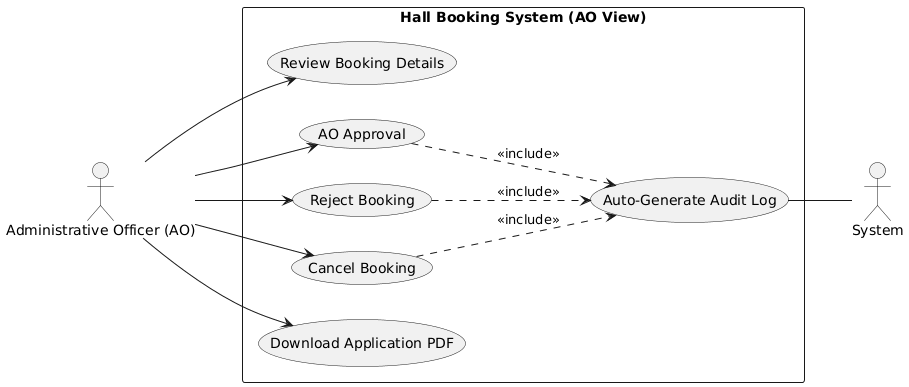
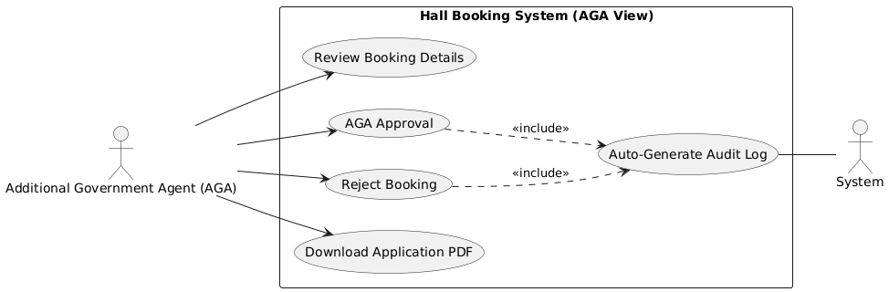
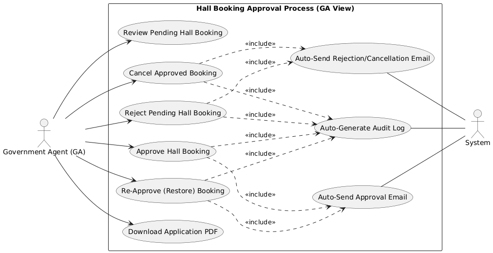
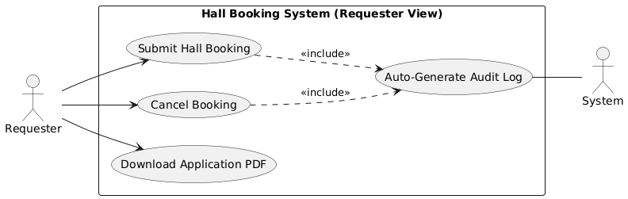

# Developer Guide: Hall Booking Approval & Post-Approval Process

This document explains the multi-stage approval workflow for hall bookings, the roles involved, and the post-approval management logic.

---

## 1. Approval Workflow Overview

The approval process is sequential, moving through three levels of verification before reaching a final status.

### Roles and Responsibilities
- **Administrative Officer (AO)**: Primary verification of the application details.
- **Additional Government Agent (AGA)**: Secondary review level.
- **Government Agent (GA)**: Final authority who grants the ultimate "Approved" or "Rejected" status.

### Use Case Diagrams by Role

#### Administrative Officer (AO)

#### Additional Government Agent (AGA)

#### Government Agent (GA)

---

## 2. Technical Implementation (`HallBookingController`)

### Approval Logic (`approve` method)
1. **Verification**: Each officer (AO/AGA) updates their specific column (`approval_status_ao`, `approval_status_aga`) to `approved`.
2. **Finalization**: When the **GA** approves, the system updates `approval_status_ga` AND sets the `final_approval` to `approved`.
3. **Notification**: Upon GA approval, the system triggers `EmailController::sendEmail()` to notify the applicant.

### Rejection Logic (`reject` method)
- Similar to approval, but sets statuses to `rejected`.
- GA rejection sets the `final_approval` to `rejected`, halting the process.

---

## 3. Post-Approval Management

Once a booking is finalized, several actions remain available depending on the user's role.

### Cancelling an Approved Booking (`cancelApproved` method)

- **GA**: Can cancel any booking that has already been finalized as "Approved" (Revoke action). A reason must be provided.
- **AO**: Can cancel a booking only if it is still in the `pending` stage (pre-emptive cancellation).
- **Requester**: Can cancel **ONLY** if all level approvals are still `pending`. This ensures users cannot cancel once the administrative work has begun.

### Re-Approval Logic (`reApprove` method)
- **GA Exclusive**: Only the Government Agent can re-approve a previously `cancelled` or `rejected` booking.
- **Conflict Check**: The system performs a strict check to ensure no other active booking has claimed the same hall and date since the original cancellation.

---

## 4. Auditing & Logging
Every approval, rejection, or cancellation is recorded in:
1. **`AuditLog`**: Stores the action, the performing user, and the timestamp.
2. **`Log` (System Logs)**: Stores detailed execution paths for error tracking.

## Developer Tips
- State transitions are managed carefully in the database. Never update `final_approval` manually without also updating the corresponding officer's status column.
- Use the `showProcessed` view to see the final audit trail of approvals for any completed application.
