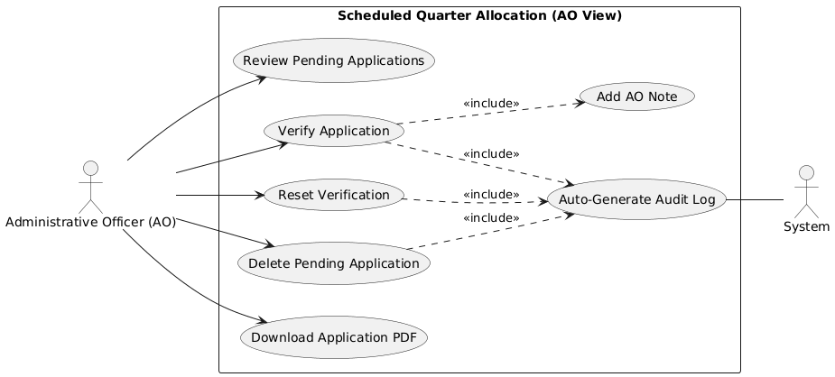
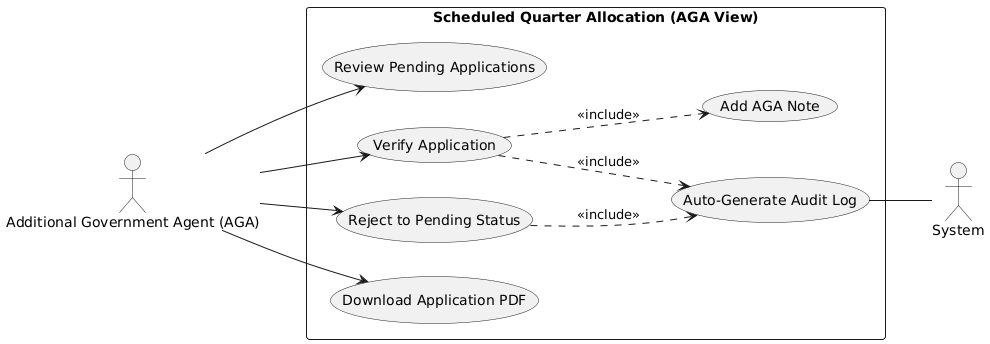
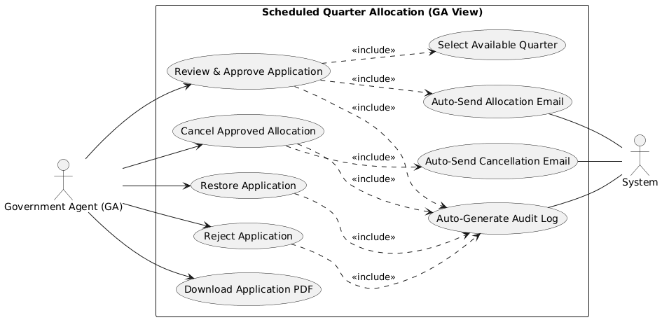
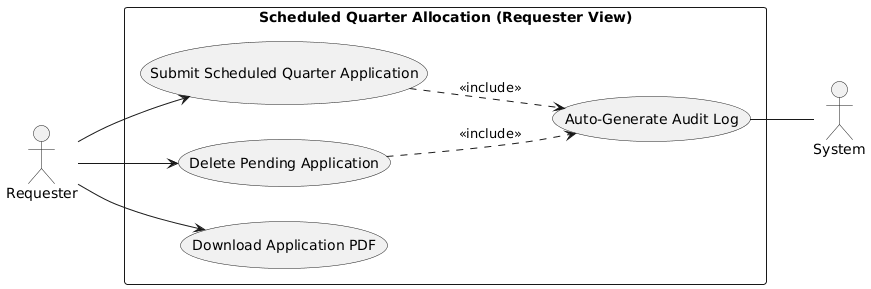

# Developer Guide: Scheduled Quarter Approval & Allocation Process

This document outlines the technical workflow for managing **Scheduled Quarter** applications, covering the approval stages, physical allocation logic, and post-approval management.

---

## 1. Approval Workflow Overview

Scheduled Quarters (e.g., Bachelors/Ladies Quarters) follow a collaborative review process where multiple officers verify eligibility before final allocation.

### Roles and Responsibilities
- **Administrative Officer (AO)**: Verifies the requester's baseline eligibility and documentation.
- **Additional Government Agent (AGA)**: Provides a second layer of verification.
- **Government Agent (GA)**: The final decision-maker for assigning a specific room/unit.

### Use Case Diagrams by Role

#### Administrative Officer (AO)

#### Additional Government Agent (AGA)

#### Government Agent (GA)

---

## 2. Technical Implementation (`QuarterAllocationController`)

### Integrated Dispatcher (`allocateScheduledQuarter`)
Scheduled quarter requests are processed through a central dispatcher method. Depending on the `action` input, the system performs:
- **Submit**: Saves verification statuses (Yes/No) and notes for AO/AGA.
- **Allocate**: Performs the physical assignment of a quarter.
- **Reject**: Finalizes a rejection decision.

### The Allocation Logic (GA Exclusive)
Unlike Family Quarters, Scheduled Quarters often involve shared occupancy.
1. **Compatibility Check**: The system validates that the requester's gender matches the `allowed_gender` of the selected quarter.
2. **Capacity Validation**: It checks if the `current_occupant_number` is less than the maximum `occupant_number` defined for that unit.
3. **Occupancy Increment**: Upon success, the system increments the `current_occupant_number` in the `quarters` table.
4. **State Transition**: The `allocation_status` moves to `'allocated'`, and the unit's status becomes `'Allocated'` if it reaches full capacity.

---

## 3. Post-Approval Management

### Cancellation & Restoration

- **GA Cancellation** (`cancelScheduledQuarter`):
  - Decrements the `current_occupant_number` in the `quarters` table.
  - Releases the room/unit back to `'Unallocated'` status if space becomes available.
  - Records an Audit Log and sends a cancellation email.
- **AO/AGA Restoration**: If an application was rejected in error, it can be restored to `pending` status with a mandatory restoration note.

### Requester Deletion
- Requesters can delete their own application ONLY while it is completely `pending` (neither AO nor AGA has submitted verification).

---

## 4. Auditing & Notifications
- **Audit Logs**: Every verification update, allocation, and cancellation is logged with detail regarding the officer involved.
- **Automated Emails**: The system automatically triggers allocation or cancellation emails upon GA's final action.

## Developer Tips
- For Scheduled Quarters, always monitor the `current_occupant_number` vs `occupant_number` to ensure the system prevents over-booking.
- The `AuditLog` table is the source of truth for tracking which officer performed each verification step.
